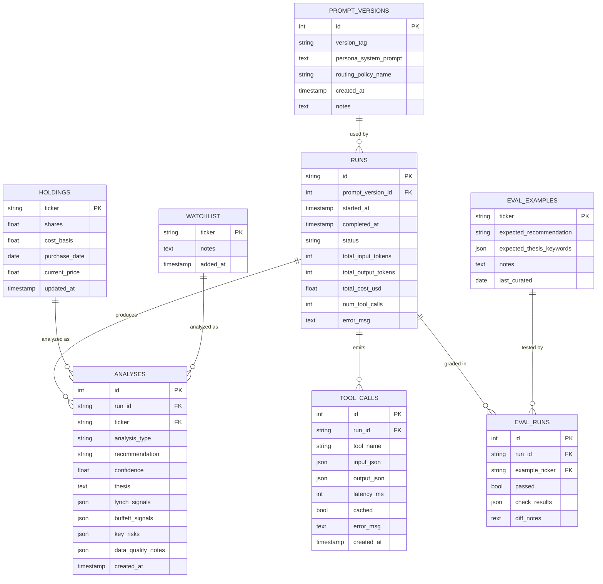

# Tech Spec: Local Stock Analysis Agent Harness
 
**Companion to:** `PRD.md` v1.0
**Version:** 1.0 (Draft)
**Scope:** Design doc — key decisions and interfaces, not file-by-file implementation
**Last updated:** 2026-05-07
 
---
 
## 0. How to read this doc
 
The PRD answered *what* and *why*. This spec answers *how*, with focus on the four areas you flagged as least settled:
 
1. **Agent loop mechanics** — §3
2. **Model routing + prompt caching** — §4
3. **Tool interface contracts** — §5
4. **Eval harness** — §6
Sections 1–2 set foundations. Sections 7–9 cover storage, observability, and open design questions surfaced during drafting.
 
Where the PRD already nailed a decision, I cite it (e.g. "PRD §6.3") rather than restate. Where I'm flagging a *change* from the PRD, I mark it **⚠ revision**.
 
---
 
## 1. Foundational decisions verified at draft time
 
Three things in the PRD depend on current Anthropic facts. Verified May 7, 2026:
 
| Item | Status | Source |
|---|---|---|
| `claude-opus-4-7` model ID | ✅ correct | Anthropic docs |
| `claude-sonnet-4-6` model ID | ✅ correct | Anthropic docs |
| `claude-haiku-4-5-20251001` model ID | ✅ correct (note the date suffix — Haiku uses dated string, Sonnet/Opus do not) | Anthropic docs |
| Pricing: Opus 4.7 $5/$25, Sonnet 4.6 $3/$15, Haiku 4.5 $1/$5 per MTok | ✅ correct | Anthropic pricing page |
| Cache read = 10% of base input price; 5m cache write = 1.25×; 1h cache write = 2× | ✅ correct | Anthropic prompt-caching docs |
| Minimum cacheable prefix = 1024 tokens (Sonnet/Opus); **4096 tokens for Haiku 4.5** | ⚠ matters for routing — see §4.3 | Anthropic prompt-caching docs |
| Max cache breakpoints per request = 4 | Constrains breakpoint placement strategy | Anthropic prompt-caching docs |
 
**Implication for the harness:** Haiku's 4096-token minimum is higher than I'd assumed. The S&P 500 screening pass needs a system prompt + universe data block ≥4096 tokens for caching to activate. This is easy to hit with the persona + screening rubric, but worth designing for explicitly rather than discovering at implementation.
 
---
 
## 2. Architectural shape
 
### 2.1 Two execution modes, one agent
 
The agent has two entry points, both calling the same underlying `analyze_ticker()` function with different parameters:
 
```
┌──────────────────┐       ┌──────────────────┐
│  nightly_run()   │       │   eval_run()     │
│  (cron-driven)   │       │  (manual / CI)   │
└────────┬─────────┘       └────────┬─────────┘
         │                          │
         └────────────┬─────────────┘
                      ▼
         ┌────────────────────────┐
         │  analyze_ticker(       │
         │    ticker,             │
         │    persona,            │
         │    routing_policy,     │
         │    budget,             │
         │    run_context         │
         │  )                     │
         └────────────────────────┘
```
 
This matters because the v2 multi-agent split (PRD §4.2) becomes "call `analyze_ticker()` N times with different `persona` arguments." Keeping the function pure (no global state) is the cheapest way to preserve that path.
 
### 2.2 Process model
 
Single Python process per run. No threading, no async for the agent loop itself — sequential ticker processing keeps traces readable and cost attribution clean. Async only inside data fetchers where it matters (concurrent yfinance + Finnhub calls for the same ticker).
 
**Why not parallel ticker analysis?** Two reasons: (1) prompt caching benefits from sequential calls hitting the same warm cache prefix, and (2) debugging an agent loop with N concurrent traces is meaningfully harder than N sequential ones. A 30-ticker run at ~30s/ticker is 15 minutes — fine for overnight.
 
---
 
## 3. Agent loop mechanics
 
### 3.1 Loop shape
 
The loop is a standard tool-use loop with explicit termination conditions:
 
```python
def analyze_ticker(ticker, persona, routing_policy, budget, run_context):
    messages = [{"role": "user", "content": initial_user_prompt(ticker)}]
    iteration = 0
    
    while True:
        iteration += 1
        
        # Pre-call guards
        check_iteration_cap(iteration, max=8)         # PRD §6.3
        check_token_budget(budget, run_context)
        check_cost_ceiling(budget, run_context)
        
        # Model selection happens per-call, not once per ticker
        model = routing_policy.select(iteration, messages, ticker)
        
        response = call_claude(
            model=model,
            system=persona.system_prompt,        # cached
            tools=TOOL_DEFINITIONS,              # cached
            messages=messages,
            cache_breakpoints=cache_strategy(),  # see §4.3
        )
        
        log_turn(run_context, iteration, model, response)
        
        if response.stop_reason == "end_turn":
            return parse_final_output(response)  # validated against Pydantic
        
        if response.stop_reason == "tool_use":
            tool_results = execute_tools(response.tool_uses, run_context)
            messages.append({"role": "assistant", "content": response.content})
            messages.append({"role": "user", "content": tool_results})
            continue
        
        # Anything else (max_tokens, refusal, etc.) is a hard error
        raise UnexpectedStopReason(response.stop_reason)
```
 
### 3.2 Termination conditions
 
The loop terminates on whichever of these fires first:
 
| Condition | Action | Logged as |
|---|---|---|
| `stop_reason == "end_turn"` with valid Pydantic output | Return analysis | `success` |
| `stop_reason == "end_turn"` with malformed output | One repair attempt with explicit schema reminder, then fail | `schema_repair_success` / `schema_repair_failed` |
| Iteration cap (8 tool calls per ticker) | Force final-answer turn with system note "you have reached the iteration cap, produce your best analysis with available info" | `iteration_capped` |
| Token budget per ticker exceeded | Same as iteration cap | `token_capped` |
| Run-level cost ceiling exceeded | Abort entire run, mark remaining tickers as `skipped` | `cost_aborted` |
| Tool call exception (after retries) | Inject error message as tool result, let agent continue | `tool_error_recovered` |
| Repeated tool error (same tool, same input, ≥3 times) | Force final-answer turn | `tool_loop_broken` |
 
**Two things worth noting:**
 
- The "force final-answer turn" pattern (used for caps and repeated tool errors) is more instructive than just truncating. The agent gets to produce *something* with caveats in `data_quality_notes`, and the eval set can grade how well it degrades.
- Schema repair is a single retry, not a loop. If the model can't produce valid JSON twice, that's a prompt problem, not a runtime-resilience problem.
### 3.3 Tool dispatch
 
Tool calls are dispatched through a registry, not a giant if-else:
 
```python
TOOL_REGISTRY: dict[str, Tool] = {
    "get_quote": GetQuoteTool(),
    "get_fundamentals": GetFundamentalsTool(),
    # ...
}
 
def execute_tools(tool_uses, run_context):
    results = []
    for tu in tool_uses:
        tool = TOOL_REGISTRY[tu.name]
        result = tool.run(tu.input, run_context)  # handles retry, caching, logging
        results.append({"type": "tool_result", "tool_use_id": tu.id, "content": result.serialize()})
    return results
```
 
The registry pattern matters because v2 multi-agent splits will likely subset tools per persona (Lynch agent might not need filing-reading depth; Buffett agent definitely does). Keeping dispatch table-driven makes that subsetting trivial.
 
### 3.4 Error handling layers
 
There are three distinct failure modes, each handled differently:
 
1. **Data source errors** (network, rate limit, malformed response) → handled inside the tool, with retry + backoff. Tool returns a structured error to the agent, which decides whether to retry, swap tools, or note it in output.
2. **Agent loop errors** (schema mismatch, iteration cap, repeated tool failures) → handled in the loop runner, with the "force final answer" or "single repair retry" patterns above.
3. **Run-level errors** (DB write failure, config missing, cost ceiling) → propagate up, abort run, write partial results + error reason to `runs` table.
This layering is mostly about *where* the resilience logic lives. Layering it sloppily — e.g. retrying network errors in the agent loop — is how harnesses become unreadable.
 
---
 
## 4. Model routing + prompt caching
 
### 4.1 Routing policy interface
 
Routing is a strategy object, not hardcoded if-statements:
 
```python
class RoutingPolicy(Protocol):
    def select(self, iteration: int, messages: list, ticker: str) -> ModelID: ...
```
 
The default v1 policy is `PhaseBasedRouting`:
 
```python
class PhaseBasedRouting:
    def select(self, iteration, messages, ticker):
        phase = current_phase(messages)  # inspects the conversation state
        return {
            "screen":     "claude-haiku-4-5-20251001",
            "deep":       "claude-sonnet-4-6",
            "synthesize": "claude-opus-4-7",  # only if conflict flag set
        }[phase]
```
 
This is overkill for v1 *as written* — phases map cleanly to top-level functions, so you could just hardcode the model in `screen_universe()` vs `analyze_ticker()`. But keeping it as a strategy means eval comparisons like "what if we use Sonnet for screening too?" are a one-line change, which is exactly the harness skill the project is meant to teach.
 
### 4.2 When does Opus actually fire?
 
The PRD says "only if needed." Concretely, the synthesis Opus call fires only when:
 
- ≥2 holdings have `confidence < 0.5` AND `recommendation != "hold"` (i.e. low-confidence action calls), OR
- The Lynch and Buffett signal counts disagree by ≥3 (e.g. 4 Lynch pros, 1 Buffett pro — likely a growth-vs-quality tension worth resolving), OR
- A holding has a `recommendation = "sell"` — Opus second-opinion before surfacing it
Most nights this should fire 0–2 times. If it fires every night, the trigger conditions are too loose and need tightening (track this in observability).
 
### 4.3 Prompt caching strategy
 
**The cache layout matters more than the model choice for cost.** Anthropic's caching gives 10% read cost vs base input, with a 25% write surcharge. For a nightly run hitting 30+ tickers with the same system prompt + tool schemas, this is the single biggest cost lever.
 
Cache breakpoints (max 4 per request):
 
```
┌───────────────────────────────────────────────────────────┐
│ Request structure (top to bottom = prefix order)          │
├───────────────────────────────────────────────────────────┤
│ tools:        [tool definitions]              ← BP1 (1h)  │  stable
│ system:       [persona + analysis rubric]     ← BP2 (1h)  │  stable
│ system:       [user portfolio context]        ← BP3 (5m)  │  per-run
│ messages:     [ticker-specific conversation]  ← BP4 (5m)  │  per-ticker
└───────────────────────────────────────────────────────────┘
```
 
**Why this layout:**
 
- BP1 (tools) and BP2 (persona) change only when you ship a new prompt version. 1h TTL keeps them warm across the whole nightly run (~15 min) and even spans test invocations during the day.
- BP3 (portfolio) is identical across all tickers in one run but changes between runs. 5m TTL is fine — sequential ticker analysis keeps it warm.
- BP4 lets each ticker's per-call context be incremental, so the *next* turn for the same ticker hits warm cache up through the prior turn.
**Anthropic's TTL ordering rule:** longer TTLs must appear before shorter TTLs in the request. The layout above respects this (1h, 1h, 5m, 5m). Violating this silently breaks caching, so a unit test should assert TTL ordering on every request.
 
**Haiku 4096-token minimum:** the system prompt + tool defs need to clear 4096 tokens combined for the screening pass to benefit from caching. Worth measuring at the end of week 3; if short, pad with explicit screening rubric (which is useful prompt content anyway, not filler).
 
### 4.4 Expected cost shape
 
Rough math for a 30-holding + 5-discovery run (35 deep analyses + 1 screening pass):
 
| Component | Tokens (est.) | Model | Cached? | Cost (USD) |
|---|---|---|---|---|
| Screening pass: input | 200K | Haiku | most cached | ~$0.04 |
| Screening pass: output | 5K | Haiku | n/a | ~$0.025 |
| 35× deep analysis: input | 35 × ~30K = 1.05M | Sonnet | persona/tools cached | ~$0.95 |
| 35× deep analysis: output | 35 × ~2K = 70K | Sonnet | n/a | ~$1.05 |
| Synthesis (1× expected) | ~50K in / 5K out | Opus | partial | ~$0.38 |
| **Run total** | | | | **~$2.45** |
 
This is over the PRD's $1.50/run cap. Two options:
 
- **(a)** Tighten the cap to $2.50 and accept it. Monthly = $75. Still under the $20/mo PRD ceiling? **No** — that's the conflict.
- **(b)** Keep $1.50/run but tighten scope: limit deep analysis to 15 holdings + 3 discovery candidates per night, rotating the rest on a 2-day cycle. Monthly = ~$45.
- **(c)** Stay aggressive on caching and use the Batch API (50% discount on input + output) for the screening pass since it's not latency-sensitive. Drops screening cost by half.
**⚠ revision recommended:** the PRD's $20/mo target plus $1.50/run cap implies ≤13 runs/month, which contradicts "nightly." Either the cap goes up or the scope per run comes down. Worth resolving in week 3 before scaling up. My weak preference is **(b) + (c)** combined: rotation reduces tokens, batching reduces unit cost, and both are instructive to implement.
 
---
 
## 5. Tool interface contracts
 
### 5.1 Universal tool shape
 
Every tool implements the same protocol, which the agent loop and the eval harness both depend on:
 
```python
class Tool(Protocol):
    name: str                          # matches Anthropic tool_use name
    description: str                   # shown to the model
    input_schema: type[BaseModel]      # Pydantic
    output_schema: type[BaseModel]     # Pydantic
    
    def run(self, input: BaseModel, ctx: RunContext) -> ToolResult: ...
```
 
`ToolResult` is a discriminated union:
 
```python
class ToolResultOk(BaseModel):
    status: Literal["ok"] = "ok"
    data: BaseModel              # the output_schema instance
    cached: bool                 # was this a local DB cache hit?
    latency_ms: int
 
class ToolResultError(BaseModel):
    status: Literal["error"] = "error"
    error_code: Literal["rate_limit", "not_found", "stale_data", "network", "unknown"]
    message: str                 # surfaced to the agent verbatim
    retryable: bool
 
ToolResult = ToolResultOk | ToolResultError
```
 
**Why the discriminated union and not exceptions:** the agent needs to *see* errors to make tool-selection decisions ("yfinance gave me stale data, let me try Finnhub"). Exceptions get caught at the loop boundary, which would hide them from the model. This is one of the more important harness-design moves.
 
### 5.2 Per-tool schemas (representative)
 
I'll spec two in detail, the rest follow the same shape.
 
#### `get_fundamentals`
 
```python
class GetFundamentalsInput(BaseModel):
    ticker: str = Field(pattern=r"^[A-Z]{1,5}$")
 
class FundamentalsData(BaseModel):
    ticker: str
    as_of: date
    pe_ratio: float | None
    pb_ratio: float | None
    roe_pct: float | None
    debt_to_equity: float | None
    fcf_ttm_usd: int | None       # in dollars, not millions — avoid unit confusion
    operating_margin_pct: float | None
    net_margin_pct: float | None
    data_age_hours: int            # how stale; agent uses to decide whether to flag
    source: Literal["yfinance", "finnhub"]
```
 
Three things worth noting:
 
- Every numeric field is `| None`. The agent must reason about missing data, not assume zero.
- `data_age_hours` is surfaced to the model. The persona prompt instructs flagging anything older than 48h.
- `source` lets the agent know provenance. If yfinance returns a value and Finnhub disagrees, the model sees it and the eval set can test for that case.
#### `read_filing`
 
```python
class ReadFilingInput(BaseModel):
    ticker: str = Field(pattern=r"^[A-Z]{1,5}$")
    filing_type: Literal["10-K", "10-Q", "8-K"]
    section: Literal[
        "business",          # Item 1
        "risk_factors",      # Item 1A
        "mdna",              # Item 7
        "financial_statements",
        "executive_summary"  # synthesized first 2 pages
    ]
    fiscal_year: int | None = None  # defaults to most recent
 
class FilingSection(BaseModel):
    ticker: str
    filing_type: str
    section: str
    fiscal_year: int
    filing_date: date
    text: str                   # truncated to 50K tokens; agent must reason at this granularity
    word_count: int
    truncated: bool             # True if filing section exceeded limit
    edgar_url: str
```
 
The 50K-token cap matters. A full risk-factors section can run 80K tokens. Better to give the agent a marker that there's more and let it decide whether to fetch the next chunk than to silently swallow content.
 
### 5.3 Caching layer
 
Tool results cache to SQLite with TTL (PRD §5.2). Cache keys = `(tool_name, hash(input_schema_dump))`. Two notes:
 
- The cache is **per-tool**, not per-call. `get_quote("AAPL")` and `get_fundamentals("AAPL")` are independent entries.
- Cache hits log `cached: true` in `tool_calls`. Useful for evals: "what fraction of tool calls were warm?" tells you whether the run is doing meaningful work or just paying tokens to read cached data.
### 5.4 Error semantics
 
The `error_code` field has semantic load:
 
| Code | Agent should | Loop should |
|---|---|---|
| `rate_limit` | Try a different tool/source | Retry tool internally first (exp. backoff, max 3) |
| `not_found` | Note in `data_quality_notes`, proceed | No retry |
| `stale_data` | Use the data, flag age in output | No retry |
| `network` | Try once more or pivot | Retry tool internally first (max 2) |
| `unknown` | Note and proceed | Log loudly, no retry |
 
These mappings live in the tool implementations, not the agent prompt. The persona prompt just says "tool errors are real signals — read them and decide." Trusting the model to respond correctly to clearly-categorized errors is part of what we're testing.
 
---
 
## 6. Eval harness
 
### 6.1 Why this is the spec's most important section
 
Per the PRD's success criterion #8 ("understanding the harness well enough to write a 1-page summary"), the eval harness is the single thing that makes iteration honest. Without it, you can't tell whether changing the persona prompt helped or hurt — you'll have priors but no measurement. Every other section in this doc supports the eval section; not the other way around.
 
### 6.2 Golden set format
 
A YAML file, hand-curated, version-controlled in `eval/examples/`:
 
```yaml
# eval/examples/aapl.yaml
ticker: AAPL
notes: |
  Apple is a Buffett-style holding for most of his career; should surface
  ecosystem moat, services-as-recurring-revenue, capital return program.
  At ~$220 (mid-2026) it's not screaming-cheap; agent should not recommend
  buy without specific catalyst.
last_curated: 2026-04-15
 
expectations:
  recommendation:
    allowed: [hold, buy]            # sell would be a clear miss
    preferred: hold
  
  thesis_must_mention:               # substring or keyword presence
    - any_of: [moat, ecosystem, switching costs]
    - any_of: [services, recurring]
    - any_of: [buyback, capital return, dividend]
  
  thesis_must_not_mention:
    - "guaranteed"                   # never in valid analysis
    - "moonshot"                     # tonal mismatch
  
  buffett_signals.pros:
    min_count: 2
  
  key_risks:
    must_include_one_of: [regulatory, antitrust, services growth slowing, China]
  
  numerical_grounding:
    min_specific_numbers: 3          # the analysis cites at least 3 numbers from tools
    no_hallucinated_format: true     # no "$X.YYY billion" without source
```
 
**Why YAML and not Pydantic-as-spec:** humans curate this, and YAML's tolerance for comments and multiline strings beats Python literals here. A loader converts YAML → typed `EvalExample` objects on read.
 
**Curation guidance:** 10–15 tickers covering (a) clear-buy-quality (e.g. quality compounder at fair price), (b) clear-hold (e.g. fully-valued mega-cap), (c) clear-sell-or-avoid (deteriorating fundamentals), (d) ambiguous-by-design (turnaround, cyclical bottom, post-IPO growth). The ambiguous cases are where prompt changes will show up most clearly.
 
### 6.3 Replay command and determinism
 
```bash
python -m agent.eval --golden-set --output runs/eval-2026-05-07.json
```
 
Replay determinism is *bounded*, not absolute:
 
- Tool calls hit a recorded fixture cache (`eval/fixtures/{ticker}/{tool}/{input_hash}.json`) — never the live network during eval. This is the biggest single thing that makes evals repeatable.
- Model temperature is set to 0 via the API. Note: this is not perfectly deterministic at the token level, but is close enough for keyword-presence assertions.
- A fixed `eval_run_id` is logged so diffs can compare specific runs by ID.
**Fixture refresh policy:** fixtures regenerate on demand via `python -m agent.eval --refresh-fixtures AAPL`. Without this, fixtures rot — yfinance schemas drift, fundamentals dates advance, the model starts seeing a 2025 Q4 filing as "the latest" forever. Refresh quarterly at minimum.
 
### 6.4 Pass/fail and diff format
 
Each example produces a structured grade:
 
```python
class EvalGrade(BaseModel):
    ticker: str
    passed: bool
    checks: list[CheckResult]
    overall_notes: str
 
class CheckResult(BaseModel):
    check_name: str            # "recommendation_in_allowed", "thesis_mentions_moat", etc.
    passed: bool
    expected: str
    actual: str
    severity: Literal["must", "should"]  # 'should' failures don't fail the example
```
 
Diff view in dashboard shows:
- Current run vs. baseline run, side-by-side, with `must` failures highlighted red
- Aggregated pass rate across the golden set per run
- Per-prompt-version regression chart over time
**The thing this enables that nothing else does:** changing the persona prompt and then asking "did 11/15 pass before, now 13/15 pass with these specific differences?" is a *measurable* improvement statement. That's the harness skill.
 
### 6.5 What evals don't catch
 
Worth being honest:
 
- Subjective quality (is the thesis well-written?) — keyword presence is a crude proxy
- Long-horizon correctness (was the recommendation right?) — that requires real backtesting, which the PRD scopes out
- Novel reasoning (did the agent surface a non-obvious risk?) — by definition, golden sets can't predict these
So the eval harness measures **regression and basic correctness**, not quality ceiling. The dashboard's manual review remains the quality-ceiling check.
 
---
 
## 7. Storage layer specifics
 
The PRD §5.4 schema is mostly right. This section adds the visual data model, four additions, and an indexing plan.
 
### 7.1 Data model (ERD)
 

 
The schema groups into three logical clusters:
 
- **Portfolio cluster** (`holdings`, `watchlist`) — the input side. `analyses.ticker` polymorphically references either table depending on `analysis_type` ("holding" vs "discovery"). SQLite doesn't enforce that polymorphic relationship; it lives in application logic. Worth a constraint comment in `schema.sql`.
- **Execution cluster** (`prompt_versions` → `runs` → `{analyses, tool_calls}`) — the bulk of the model. The `prompt_version_id` chain is what makes "did changing the persona help?" answerable from data: every analysis traces to the exact prompt that produced it, so eval comparisons have a stable axis.
- **Eval cluster** (`eval_examples`, `eval_runs`) — intentionally small. `eval_runs.run_id` references the same `runs` table as production, so a prompt change that helps production tickers and breaks the golden set both surface against the same `prompt_version_id`. No separate eval runtime to maintain.
### 7.2 New table: `prompt_versions`
 
```sql
prompt_versions(
  id INTEGER PRIMARY KEY,
  version_tag TEXT NOT NULL,         -- e.g. "v3-buffett-emphasis"
  persona_system_prompt TEXT,
  routing_policy_name TEXT,
  created_at TIMESTAMP,
  notes TEXT
)
```
 
And `runs.prompt_version_id` foreign-keys into it. Without this, "did changing the prompt help" is unanswerable from data — you only know which run produced what, not which prompt produced which run.
 
### 7.3 Idempotency on writes
 
Every `analyses` write keys on `(run_id, ticker)` with `INSERT OR REPLACE`. Reason: the agent may produce a partial result, hit a transient error during DB write, and retry. Idempotent writes mean retries are safe.
 
### 7.4 The `tool_calls.output_json` truncation rule
 
Filing reads can be 50K tokens. Storing them in `tool_calls.output_json` bloats the DB fast. Rule: anything over 8KB stores a hash + path to a separate file under `logs/runs/{run_id}/tool_outputs/`. The DB row keeps the metadata.
 
### 7.5 Indexes
 
Two queries dominate runtime — both for the dashboard, both run on every page load:
 
```sql
CREATE INDEX idx_analyses_ticker_created  ON analyses(ticker, created_at DESC);
CREATE INDEX idx_analyses_run             ON analyses(run_id);
CREATE INDEX idx_tool_calls_run           ON tool_calls(run_id);
CREATE INDEX idx_runs_started             ON runs(started_at DESC);
CREATE INDEX idx_eval_runs_run            ON eval_runs(run_id);
```
 
`analyses(ticker, created_at DESC)` is the compound that matters most — "show me AAPL's analysis history" is a hot path on the History page. The DESC ordering means "most recent" reads don't need a sort step.
 
Add these in week 1, not week 5. They cost nothing on an empty DB, and retrofitting indexes after the dashboard feels slow is a worse use of time than getting them right the first pass.
 
---
 
## 8. Observability — concrete schema
 
PRD §7 specifies "medium tier." Concretely, the JSONL trace per run looks like:
 
```jsonl
{"ts":"...","run_id":"r_abc","event":"run_started","portfolio_size":12,"watchlist_size":8}
{"ts":"...","run_id":"r_abc","event":"phase_started","phase":"screening","model":"claude-haiku-4-5-20251001"}
{"ts":"...","run_id":"r_abc","event":"llm_call","ticker":null,"phase":"screening","model":"...","input_tokens":4523,"cache_read_tokens":4200,"cache_creation_tokens":323,"output_tokens":1840,"latency_ms":3200,"cost_usd":0.029}
{"ts":"...","run_id":"r_abc","event":"phase_completed","phase":"screening","candidates_surfaced":["MSFT","GOOG","BRK.B","COST","V"]}
{"ts":"...","run_id":"r_abc","event":"ticker_started","ticker":"AAPL","phase":"deep","model":"claude-sonnet-4-6"}
{"ts":"...","run_id":"r_abc","event":"tool_call","ticker":"AAPL","tool":"get_fundamentals","cached":false,"latency_ms":420,"status":"ok"}
{"ts":"...","run_id":"r_abc","event":"tool_call","ticker":"AAPL","tool":"read_filing","cached":false,"latency_ms":1850,"status":"ok"}
{"ts":"...","run_id":"r_abc","event":"llm_call","ticker":"AAPL",...}
{"ts":"...","run_id":"r_abc","event":"ticker_completed","ticker":"AAPL","recommendation":"hold","confidence":0.72,"iterations":4,"tokens":18443,"cost_usd":0.054}
{"ts":"...","run_id":"r_abc","event":"run_completed","status":"success","total_cost_usd":2.31,"duration_seconds":847}
```
 
**Why JSONL and not OpenTelemetry:** JSONL grep-ability is the v1 superpower. `cat logs/runs/*.jsonl | jq 'select(.event=="ticker_completed") | .cost_usd' | awk '{s+=$1} END {print s}'` is a one-liner. OTel is the right answer for v2+.
 
**The most useful query you'll run repeatedly:** "show me every tool call where the agent then immediately called a different tool with the same ticker." That's the "agent didn't trust the answer" pattern and is high signal for prompt tuning.
 
---
 
## 9. Open design questions surfaced during drafting
 
Things the PRD didn't fully resolve and that will benefit from explicit decisions before week 3:
 
### Q1. Cache key granularity for the screening pass
The screening pass passes ~200 tickers in one prompt. If the universe changes by even one ticker, the cache breaks. Options:
- Fixed S&P 500 list, refreshed quarterly (stable cache prefix; misses real index changes)
- Sorted ticker list as cache content (stable across runs unless universe changes)
- Bucket by sector and analyze sectors independently (smaller caches, more requests)
**Recommendation:** sorted list of S&P 500 + watchlist union, refreshed weekly. Quarterly is too stale; per-run is too churn-y.
 
### Q2. How does the agent handle tool result conflicts?
yfinance and Finnhub will sometimes disagree on a P/E ratio (different fiscal-year-end conventions, etc.). The persona prompt says "flag stale or implausible data" but doesn't say what to do with conflicts. Options:
- Tool layer reconciles before returning (hides interesting cases)
- Surface both, agent picks (educational, makes the agent's reasoning visible)
- Surface both, prompt tells agent to prefer Finnhub for fundamentals, yfinance for prices
**Recommendation:** option 3. Prefer specific sources by data type (rationale in prompt), but show both when both succeed. This puts source-trust reasoning in the prompt layer, where it's reviewable, rather than the tool layer, where it's hidden.
 
### Q3. What does "hold" mean operationally?
PRD calls hold a valid output. But hold-with-confidence-0.4 is meaningfully different from hold-with-confidence-0.9. The dashboard should sort by `(recommendation != "hold", -confidence)` so high-confidence non-hold actions surface first. Worth specifying in §5.6's Today page.
 
### Q4. Discovery candidate persistence
If the agent flags MSFT as a discovery candidate three nights in a row with the same thesis, that's noise, not signal. Cooldown logic: a ticker that's been flagged in the last 7 days doesn't appear in discovery again unless a new news event crosses the threshold. Implement in week 4 alongside scheduling.
 
---
 
## 10. Spec → roadmap mapping
 
For sanity, mapping spec sections to PRD weeks:
 
| PRD week | Spec sections that bind | Spec deliverable |
|---|---|---|
| Week 1 | §2.1, §3.1, §3.2, §5.1, §7 | Loop runs end-to-end with one tool, one ticker, one model |
| Week 2 | §5.1–5.4 | All tools implemented to the contract |
| Week 3 | §4.1–4.4 | Routing + caching wired; cost shape measured against §4.4 estimates |
| Week 4 | §9.Q1, §9.Q4 | Universe screening + discovery cooldown + cron |
| Week 5 | §8 (dashboard surfaces) | Streamlit reads JSONL + DB |
| Week 6 | §6 entire | Golden set + replay + diff |
 
The order matters. §6 (evals) is week 6 because evals only mean something against a stable harness. But the schemas in §5 and the contracts in §3 should be designed in week 1–2 with eval needs in mind, not retrofitted in week 6.
 
---
 
## Appendix A — Decisions log delta vs PRD
 
| # | Decision | Rationale |
|---|---|---|
| 11 | Loop is sequential per ticker, not concurrent | Keeps cache warm, makes traces readable |
| 12 | Tool errors return as data, not exceptions | Agent must reason about errors |
| 13 | Routing is a strategy object | Cheap A/B testing in evals |
| 14 | Cache layout: 4 breakpoints, ordered 1h→1h→5m→5m | Required by Anthropic TTL ordering rule |
| 15 | Eval golden set = YAML, fixtures recorded | Determinism + curatability |
| 16 | New `prompt_versions` table | Without it, regression analysis is unanswerable |
| 17 | ⚠ PRD $1.50/run + $20/mo conflicts at nightly cadence | Recommend rotation + Batch API for screening |
| 18 | Tool result conflict policy: surface both, prompt prefers by source | Makes reasoning reviewable |
| 19 | Indexes added in week 1, not retrofitted | Two queries dominate dashboard runtime; cheap to add upfront |
 
---
 
## Appendix B — Things explicitly NOT in this spec
 
- Specific Pydantic field types beyond the two representative tools in §5.2 — fill in week 2
- Streamlit layout details — week 5 problem
- launchd vs cron syntax — week 4 plumbing, not design
- Exact persona prompt wording — week 3, with eval set as the judge
- v2 multi-agent orchestration — separate spec when v1 ships
